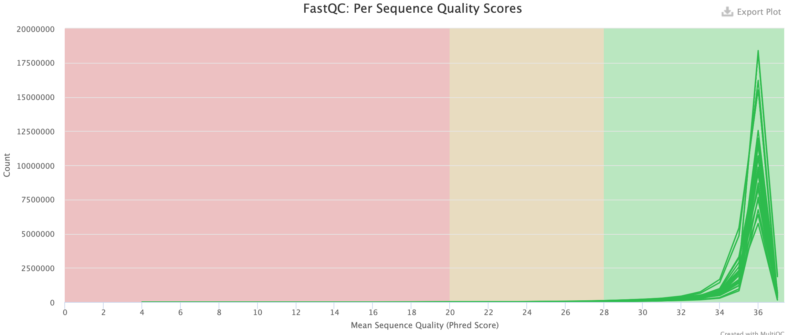

# Data analysis

## 1. Library description 

RNAseq libraries were sequenced on an Illumina HiSeq 2500 instruments, using a  paired-end protocol with 150 cycles on each end.

Number of reads per library is in table 1.

Table 1. Number of reads per library

| Lib. name     | Num. reads    |
|---------------|---------------|
| ControlA      |    16,133,265 |
| ControlB      |    09,124,634 |
| ControlC      |    12,747,390 |
| TomatoNemaA   |    24,863,144 |
| TomatoNemaB   |    14,206,067 |
| TomatoNemaC   |    11,886,063 |
| TomatoBacA    |    10,305,908 |
| TomatoBacB    |    15,639,555 |
| TomatoBacC    |    13,013,468 |
| TomaBacNemaA  |    15,343,977 |
| TomaBacNemaB  |    25,142,196 |
| TomaBacNemaC  |    16,887,674 |
|-------------------------------|

## 2. Quality control

Quality of reads was assessed with fastqc and then individual reports were aggregated with multiqc, with the following commands:
```bash
fastqc *fq.gz
multiqc .    
```
The quality of the reads was extremely high, and therefore did not require any trimming prior to pseudoalignment with Kallisto.

Figure 1. Average quality scores of all reads in all libraries.



## 3. Quantification of transcripts abundance

Quantification of transcripts was done against the ITAG4.1 transcriptome obtained from https://solgenomics.net/ftp/tomato_genome/annotation/ITAG4.1_release/.

Transcriptome was indexed as follows:

```bash
kallisto index -i ITAG4.1_cDNA.idx ITAG4.1_cDNA.fasta
```

Quantification was conducted with the following command:

```bash
for FILE in *_1.fq.gz
do
	kallisto quant -i db/tomato_ITAG4.1_kallisto/ITAG4_plus_deNovo.idx --bias -b 100 -o ${FILE/_1.fq.gz/}_kallisto --threads 12 $FILE ${FILE/_1/_2}
done
```

Results from kallisto quantification, both estimated counts and tpms were extracted with:

```bash
#!/usr/bin/bash

for DIR in *_kallisto
do
        cut -f 1 ${DIR}/abundance.tsv > names
        cut -f 4 ${DIR}/abundance.tsv | sed 1d | sed '1s/^/'$DIR'\n/' | sed 's/_kallisto//' > ${DIR}.counts
        cut -f 5 ${DIR}/abundance.tsv | sed 1d | sed '1s/^/'$DIR'\n/' | sed 's/_kallisto//' > ${DIR}.tpms
done
echo "Counts and tpms have been extracted"

COUNTS_FILE='all_samples_counts.tsv'
TPMS_FILE='all_samples_tpms.tsv'

# Paste all counts columns after names
paste names *counts > $COUNTS_FILE
# Paste all tpms columns after names
paste names *tpms > $TPMS_FILE
echo "All samples were pasted in a single file"

rm names *counts *tpms
echo "Intermediate files were deleted"

echo "Your consolidated counts are at: $COUNTS_FILE" 
echo "Your consolidated tpms are at: $TPMS_FILE"
```

This will produce a tab-separated table with samples as columns and transcripts as rows. This table is ready for differential expression analysis.

## 4. Differential expression analysis

Differential expression analysis was conducted with the Bioconductor package DESeq2, using the DESeq2.R  script. This also include the generation of several related plots.

Boxplots were produced with script boxplot_sign_transc.R.

## 5. Gene ontology analysis

Gene ontology was conducted with a customized R script using the Bioconductor package cluterProfiler.

### 5.1. Preprocessing of data

#### 5.1.1 Sort significant differentially expressed gene names

This excludes novel genes (see below) because gene ontology classification has not been determined.

```bash
for FILE in *_q0.05.tsv 
do 
cut -f 1 $FILE | sed 1d | grep -v 'NODE' | sort | sed '1s/^/genes\n/' > ${FILE/.tsv/_sorted_genes.txt} 
done
```

#### 5.1.2 Preparation of a gene universe 

```bash
cut -f 1 all_samples_counts.tsv | sed 's/\..*//' | grep -v 'NODE' | sed '1s/^/gene\n/' > universe_sorted.txt
```

#### 5.1.3 Preparation of a gene ontology framework

This refers to the creation of a file that associates genes with gene ontology terms and gene ontology levels (biological process, molecular function and cellular compartment). We prepared  gene-to-go_relations.tsv, which works with genes from the ITAC4.1 transcriptome, but might not work with other transcriptome versions.

Proper gene ontology (GO) analysis was conducted with script GO_clusterProfiler.R.

## 6. Discovery of novel transcripts

### 6.1 Combined assembly
All twelve libraries were concatenated, all end1 files and all end2 files and assembled with RNAspades with the following command:

```bash
for FILE in *_1.fq.gz
do	
	rnaspades.py -t 12  -1 $FILE -2 ${FILE/_1/_2} -o tomato_ITAG4_rnaspades_assembly
done
```

This produced 34,793 contigs with length equal or longer than 300 bp. By default, rnaspades.py names this file contigs.fa. We renamed as tomato_nematode_rnaspades_transcripts.fa.

### 6.2 Prediction of proteins

Prediction of proteins was done in two steps. First long ORFs were predicted:

```bash
TransDecoder.LongOrfs -t tomato_nematode_rnaspades_transcripts.fa
```

Subsequently, putative proteins were predicted on the basis of having domains typically found in Eukaryotic proteins:

```
TransDecoder.Predict -t tomato_nematode_rnaspades_transcripts.fa
```

This produced file tomato_nematode_rnaspades_transcripts.fa.transdecoder.cds with 22,223 contigs, suposedly containing 5', central, and 3' moieties of proteins as well as complete proteins (ORFs that started at an start codon and ended at an stop codon).

We selected only full ORFs, which resulted in 9,731 putative complete proteins. This file was named tomato_nematode_rnaspades_transcripts.fa.transdecoder_complete.cds

Selection of complete ORF was performed with Bash commands and with scripts 'extract_dna_records.pl' and 'extract_protein_records.pl'. For that, the IDs of complete reads were parsed:

```bash
grep 'complete' tomato_nematode_rnaspades_transcripts.fa.transdecoder.cds > dna_complete.ids

grep 'complete' tomato_nematode_rnaspades_transcripts.fa.transdecoder.pep > pep_complete.ids
```
The lists of ids generated anove were used to extract only complete ORFs:

```bash
perl extract_dna_records.pl tomato_nematode_rnaspades_transcripts.fa.transdecoder.cds dna_complete.ids > tomato_nematode_rnaspades_transcripts.fa.transdecoder_complete_cds.fasta

perl extract_protein_records.pl tomato_nematode_rnaspades_transcripts.fa.transdecoder.pep pep_complete.ids > tomato_nematode_rnaspades_transcripts.fa.transdecoder_complete_pep.faa
```

### 6.2 Annotation of proteins

We used the Trinotate pipeline (https://github.com/Trinotate/Trinotate/wiki) for annotation of the predicted complete ORFs described above.

Implementation of the Trinotate pipeline include the following steps.

6.2.1 Creation of the Trinotate sqlite database and population of database with datasets

``` batch
Trinotate --db tomato_transc.db --create --trinotate_data_dir trinotate_db
```

6.2.2 Initial import of protein and transcripts data.

``` bash
Trinotate --db tomato_transc.db \
        --init \
        --gene_trans_map  tomato_nematode_rnaspades_transcripts.fa.transdecoder_complete_cds_gene-map.txt \
        --transcript_fasta tomato_nematode_rnaspades_transcripts.fa.transdecoder_complete_cds.fasta \
        --transdecoder_pep tomato_nematode_rnaspades_transcripts.fa.transdecoder_complete_pep.faa
```

The gene map file is generated from the transcripts file and can be produced with the following command:

```bash
awk '{ if ($0 ~ /^>/) { id=substr($0,2); print id "\t" id } }' tomato_nematode_rnaspades_transcripts.fa.transdecoder_complete_cds.fasta > tomato_nematode_rnaspades_transcripts.fa.transdecoder_complete_cds_gene-map.txt
```

6.2.3 Running Trinotate and uploading results onto database

```bash
DB_PATH="tomato_transc.db"

Trinotate --db ${DB_PATH} \
--run ALL \
--CPU 12 \
--transcript_fasta "tomato_nematode_rnaspades_transcripts.fa.transdecoder_complete_cds.fasta" \
--transdecoder_pep "tomato_nematode_rnaspades_transcripts.fa.transdecoder_complete_pep.faa"

Trinotate --db ${DB_PATH} --LOAD_swissprot_blastp uniprot_sprot.ncbi.blastp.outfmt6
Trinotate --db ${DB_PATH} --LOAD_pfam TrinotatePFAM.out
Trinotate --db ${DB_PATH} --LOAD_signalp6 sigP6outdir/prediction_results.txt
Trinotate --db ${DB_PATH} --LOAD_EggnogMapper eggnog_mapper.emapper.annotations
Trinotate --db ${DB_PATH} --LOAD_tmhmmv2 tmhmm.v2.out

Trinotate --db ${DB_PATH} --LOAD_swissprot_blastx uniprot_sprot.ncbi.blastx.outfmt6
Trinotate --db ${DB_PATH} --LOAD_infernal infernal.out
```

And finally annotation results can be retrieved from the sqlite database with the following command:

```bash
Trinotate --db  tomato_transc.db --report > tomato_transc_Trinotate_report.tsv
```

Protein IDs were extracted from the report file and annotations were retrieved from the UniProt database with script 'retrieve_protein_annotations_uniprot.py'

```bash
python retrieve_protein_annotations_uniprot.py protein_ids_list.txt > tomato_assembly_annotations.tsv 
```


